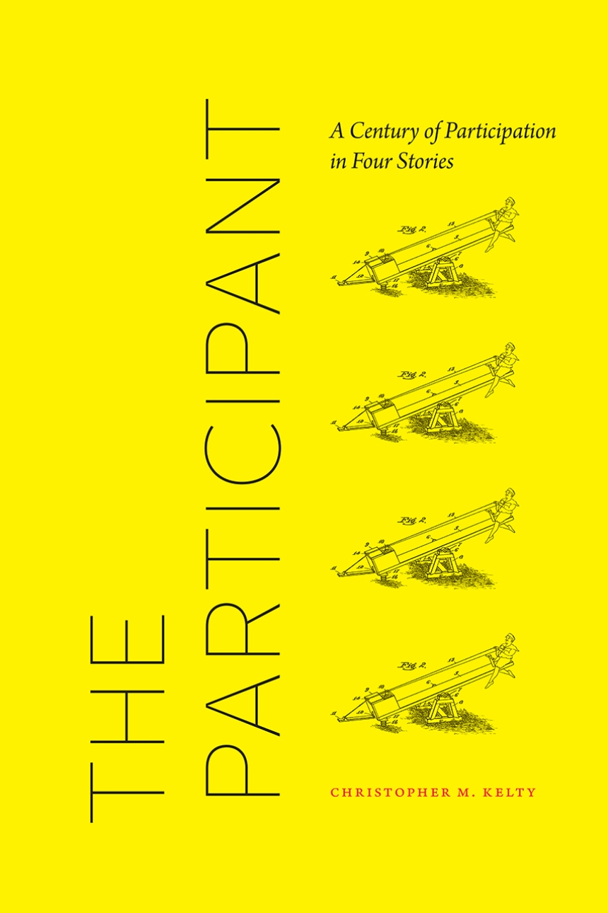

By: [Christopher Kelty](https://press.uchicago.edu/ucp/books/book/chicago/P/bo44520895.html)

Ongoing Book Notes:
Participation is a "poorly mapped" territory. Often seen as unquestionably 'good'. Participation spread. Mill viewed it as a "school of democracy", and Lincoln codified it in the democracy of the late nineteenth century with his "of the people, by the people and for the people." There was an outward expansion into the workforce and Church in the 20th century. 

Similar to how Finn Brunton understands "community" in his counter history of the internet (SPAM)

The idea of digital participation offers tangible fuel to the cultural imagination, to the vision of 'direct democracy'. Kelty, who studied a manifestation of digital participation in his book the Cultural Significance of Free Software. 

The discourse of Use is a different lens than that of participation. Use is focused on the product that comes from technologies, and how that process of creation is both world and subject-shaping.

* Democray & Participation
	* Decentralized

'"In the 1960s, such bureaucrats and technical experts represented a broken form of democracy - one that relied on expert judgements, couched in a inaccesible jargon authorized by the prestige of engineering, mathematics and scientific management. Politics has been captured by these men, and the movements of the 1960s saw it as a necessary countermovement to liberate government from the elites and experts, and return it to a decentralized, face-to-face politics of the local."'

"The image of expertise has haunted the notion of participation ever since — and the stories I tell about 'formatting' of participation in the twentieth century track how the desire to return governance to the people through participation has often ended up creating new versions of the monsters it sought to defeat: proceduralized and (ironically) expert-led forms of 'engagment' and direct citizen involvement. "
